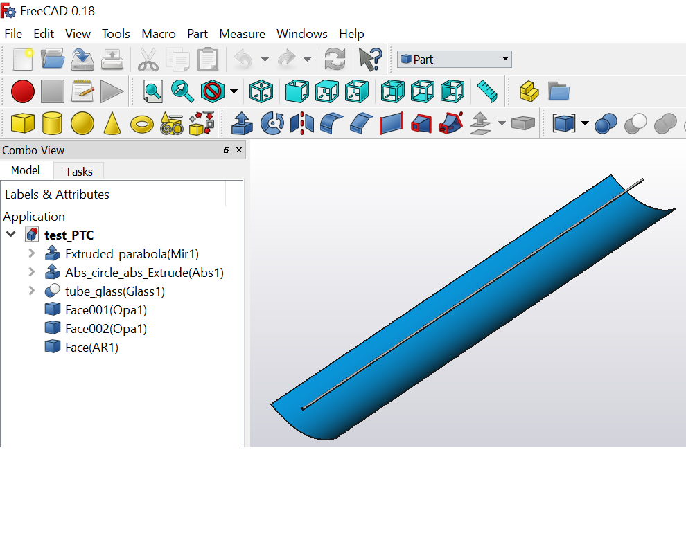

Introduction
============

The python package ``otsun`` is composed by different modules, some of
them collecting helper functions that implement both mathematical and
optical methods, and other ones built around each of the main classes
that define the functionality of the package. To ease the reading of
this section, where we shall be dealing with classes and instances of
those classes, whenever a class (say ``Scene`` or ``LightSource``) is
considered, the downcase version of their identifiers (``scene`` and
``light_source`` in our example) will indicate instances of those
variables.

A typical use of the package involves the creation of an ``experiment``,
which specifies the solar optics experiment to be run, defined by
certain data that includes an ``scene`` and a ``light_source``. The
``scene`` holds the data of all the different objects that interact with
light rays, included in a FreeCAD document,
and where each of them has associated a ``material`` describing its
optical behaviour. When the experiment is run, the ``light_source``
creates ``ray``\ s, which interact with the scene until they either
leave the scene or are absorbed, and in this last case the collected
energy (among other data) is stored for future analysis.

We comment now the main classes that have been implemented, together
with its basic functionality. The complete documentation of the API can
be found in `ReadTheDocs <https://otsun.readthedocs.io>`_.

The ``Experiment`` class
------------------------

An ``experiment`` is initialized giving the parameters that define it:
An ``scene`` and a ``light_source`` that describe the physical
environment where the experiment takes place, and the number of rays
that has to be simulated. The execution of the experiment is launched
with the ``experiment.run()`` method, and once it is finished, the
information that has been recollected is found in instance variables
like ``experiment.captured_energy_Th`` and
``experiment.captured_energy_PV``, that give the overall thermal and
photovoltaic (respectively) energy that has been collected by active
materials found in the scene.

The ``Scene`` class
-------------------

Instances of the class ``Scene`` hold the data used to describe the
physical objects present in an experiment, stored in three main
variables, ``faces``, ``solids`` and ``materials``. Each object in the
array ``faces`` (resp. ``solids``) is a ``Part.Face`` (resp.
``Part.Solid``) object of FreeCAD that represents a surface (resp.
volume) that can affect the propagation of a ray incident with it. The
dictionary ``materials`` assigns to each face or solid a ``material``
that describes its properties.

Such an ``scene`` is initialized with an array ``objects``, all whose
elements are instances of ``Part.Feature``, and typically they are all
the objects included in a FreeCAD document. The assignation of materials
to each element is done by looking at its label. Namely, if an object
``obj`` in a FreeCAD document has a label of the form
“Label\ ``(mat_name)``”, see Figure for a
visualization of a FreeCAD file. Then the assigned material
``scene.materials[obj]`` will be the ``Material`` instance ``mat`` such
that ``mat.name`` is ``mat_name``.

The ``LightSource`` class
-------------------------

Instances of the class ``LightSource`` are used to model the source of
rays in an experiment. There are many parameters that define its
behaviour, like its ``emitting_region``, describing the physical
location of the source of the rays to be emitted, and its
``light_spectrum`` and ``direction_distribution``, describing
respectively the wavelengths and directions of the rays to be emitted.

The parameter ``light_spectrum`` can either be a constant, meaning that
all rays will be emitted with the same specified wavelength in
nanometers, or a cumulative distribution function (CDF)
:math:`F(\lambda)` represented by an array of the form
:math:`((\lambda_1,\lambda_2,\dots),(F(\lambda_1),F(\lambda_2)\dots)`.

The ``emitting_region`` has to be an instance of any class that
implements the method ``random_point()``, which returns a random point
from where a ray will be emitted, and has an attribute
``main_direction``, giving the direction of the emitted ray. For
convenience, the class ``SunWindow`` implements such an emitting region
as a rectangle in space :math:`\Pi` orthogonal to a fixed direction
:math:`\vec u`, and such that all the objects in the scene are contained
in the rectangular semi-prism
:math:`\{\Pi+\lambda\vec u\mid \lambda\ge 0\}`.

The parameter ``direction_distribution`` can either be ``None`` or an
instance of a class that implements the method ``angle_distribution()``,
giving a random angle (in degrees) of deviation for the emitted ray with
respect to the main direction :math:`\vec u`. For convenience, the class
``BuieDistribution`` implements such deviation according to the Buie
distribution, determined by its circumsolar
ratio (CSR), which is a parameter of the class.

The ``Ray`` class
-----------------

Instances of the class ``Ray`` model light rays, which are emitted by a
``light_source``. A ``ray`` is initialized giving its initial
``optical_state``, as well as the ``scene`` where it will travel.
Instances of ``OpticalState`` gather some relevant information of a
light ray at a given moment, like its ``direction``, ``polarization``
and ``material`` , giving respectively the direction and polarization
vectors, and the material where it is traveling. When the method
``ray.run()`` is called, the propagation of the ray inside the scene
starts to be simulated. A simplified version of the iteration process is
:

#. Find the closest intersection of ``ray`` with objects in ``scene``.

#. If no intersection is found, the ``ray`` is lost and the simulation
   is finished.

#. If the first intersection is with an object having a determined
   ``material``, then the method ``material.change_of_optical_state()``
   is called (with different parameters that determine how the ray hits
   the material), which decides if the ray is reflected or refracted
   (and gives the next optical state) or that the ray has been absorbed
   by some active optical element.

#. If the ray has been reflected or refracted, go to step 1.

The ``Material`` class
----------------------

The ``Material`` class is the most complex of all the classes
implemented in ``otsun``, since there are many different kinds of
materials, and their optical properties need to be explicitly stated.
There are two main subclasses, ``SurfaceMaterial`` and
``VolumeMaterial``, corresponding respectively to materials that can be
assumed to be two-dimensional (like first surface mirrors and selective
absorbers) or not (like glasses, second surface mirrors, PV active
materials, thin films, :math:`\dots` ). Any material has an important
property, ``material.name``, indicating how it will be called when
identifying objects in a scene . The physical properties of a
``material`` are encoded in ``material.properties``, a dictionary whose
contents depend on the kind of material.

Any user willing to use his own materials in his experiments can
subclass ``SurfaceMaterial`` or ``VolumeMaterial`` to adapt the contents
of ``material.properties``, that implement the specific properties of
the materials. The user must subclass the method
``material.change_of_optical_state()`` in order to implement the
computation of how the interaction with the material changes the optical
state (direction, polarization, etc.) of the ray.

Also, since it is interesting to store externally the properties of
materials, the method ``material.to_json()`` and the class method
``SubclassedMaterial.load_from_json(info)`` should be implemented. The
first one must convert any information stored in ``material.properties``
to a serializable dictionary, and the second one must use this
dictionary to reconstruct the ``material.properties`` dictionary.

The ``VolumeMaterial`` class
~~~~~~~~~~~~~~~~~~~~~~~~~~~~

Instances of ``VolumeMaterial`` represent optical properties of physical
objects whose depth is not negligible, like glasses or PV active
materials. In this case the method
``material.change_of_optical_state()`` is generically implemented using
the Fresnel equations of refraction and the Snell’s law of reflection,
but any user could subclass it and implement some other optical
behaviour of the material. Some subclasses of this class are provided,
so that materials appearing usually in the field of solar collectors can
be used without further implementations.

Some of this materials are:

-  ``SimpleVolumeMaterial``, representing a material with constant index
   of refraction and attenuation coefficient in :math:`mm^{-1}`.

-  ``WavelengthVolumeMaterial``, where the index of refraction is
   complex :math:`(\eta =n - i\kappa)` and depends on the wavelength of
   the ray. The data values are given in tabulated form
   :math:`(\lambda,n,\kappa)`. Note that the imaginary part of the
   refractive index is the so called the extinction coefficient. The
   wavelength values are given in mm.

-  ``PolarizedThinFilm``, that represents thin layers such as optical
   coatings. The data values are given in tabulated form
   :math:`(\lambda, \theta_{i}, R_s, R_p, T_s, T_p)`, where
   :math:`\theta_{i}` is the incidence angle, :math:`R` and :math:`T`
   denotes the power reflection and transmission coefficients
   respectively, and sub-index :math:`s` and :math:`p` denotes the
   perpendicular and parallel ray polarization respectively. The
   wavelength values are given in mm and the incidence angle in degrees.

-  ``PVMaterial``, that represents the active material in solar cells
   such as semiconductors or any other novel material. On the
   photo-absorption in such materials, its characterization is defined
   by the complex index of refraction :math:`(\eta =n - i\kappa)`
   depending on the light wavelength. The data values are given in
   tabulated form like the ``WavelengthVolumeMaterial`` case.

The ``SurfaceMaterial`` class
~~~~~~~~~~~~~~~~~~~~~~~~~~~~~

Any ``surface_material`` represents a two-dimensional physical object,
in the sense that its third dimension is negligible, or simply that its
behaviour does not depend on it. Examples of these objects are front
surface mirrors, selective absorbers, metallic coatings, :math:`\dots`.
In a first approximation, the interaction of a ray with such a material
can result in a reflection, an absorption or a transmittance, each with
a given probability that may depend on the wavelength of the ray and are
stored in the dictionary ``p=material.properties``. Hence,
``material.change_of_optical_state()`` generically implements these
different phenomena. These behaviour is also affected by other
properties of the material, like the booleans:

-  ``p['lambertian_material']``, indicating that, in case of reflection,
   the direction of the reflected ray should be a random vector, instead
   of that computed using the law of reflection.

-  ``p['thermal_material']``, indicating that, in case of an absorption,
   the energy is absorbed and processed, instead of lost in the
   material.

Some more specific materials are provided by subclassing
``VolumeMaterial`` and overriding the ``change_of_optical_state()``
method. Some examples of these specific materials are:

-  ``AbsorberTWModelLayer``, represents a thermal absorber where its
   absorption depends on the incidence angle according to
   :math:`\alpha =\alpha_{0} \left \{ 1-{b_{0}}\left (\frac{1}{\cos \theta} -1 \right )^c \right \}`. The following
   data values are given: :math:`\alpha_{0}, {b}, {c}`.

-  ``MetallicSpecularLayer``, represents a metal surface, such as the
   silver coating in second surface mirrors. Fresnel optic equations are
   considered and its characterization is defined by the complex index
   of refraction :math:`(\eta =n - i\kappa)` depending on the light
   wavelength. The data values are given in tabulated form like the
   ``WavelengthVolumeMaterial`` case.

-  ``MetallicLAmbertianLayer``, represents a metal surface where Fresnel
   optic equations are considered but if the ray is reflected a total
   diffuse reflection model with the Lambertian scattering is
   considered. Its characterization is defined by the complex index of
   refraction :math:`(\eta =n - i\kappa)` depending on the light
   wavelength. The data values are given in tabulated form like the
   ``WavelengthVolumeMaterial`` case.

-  ``PolarizedCoatingLayer``, and its subclasses
   ``PolarizedCoatingReflectorLayer``,
   ``PolarizedCoatingTransparenLayer``,
   ``PolarizedCoatingAbsorberLayer``, that represents thin layers such
   as optical coatings. The difference with the ``PolarizedThinFilm`` is
   that the width of such materials is negligible (it is a
   ``SurfaceMaterial``). The data values are given as the
   ``SurfaceMaterial`` case. Depending on the role of the material three
   cases are defined: reflector (no light transmission), transparent,
   and thermal absorber.

